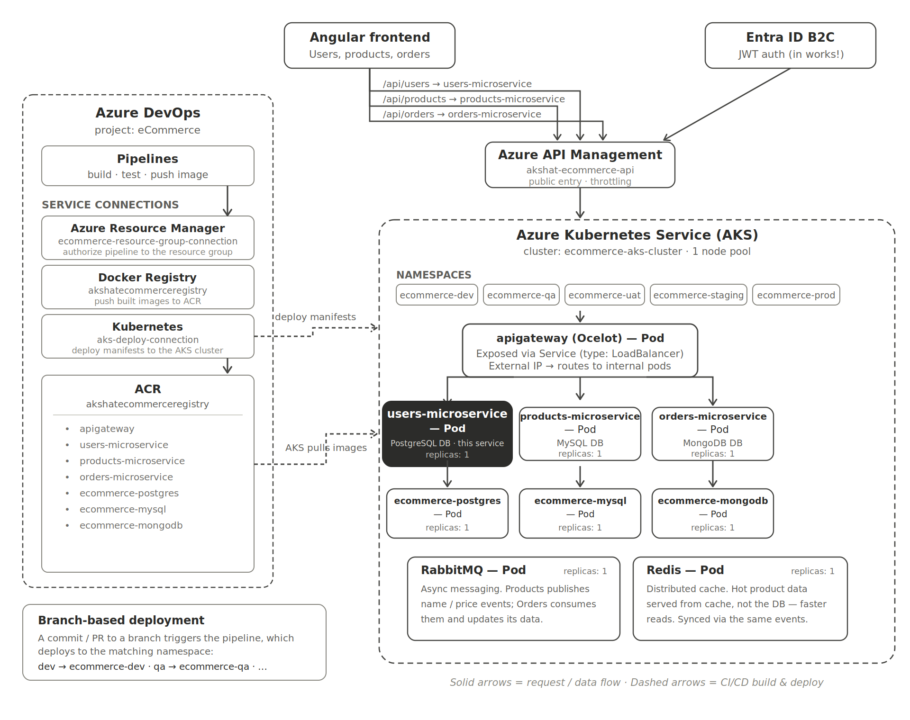

# ECommerceAppSolution.UserService

Part of a **3-service microservices architecture** built with **ASP.NET Core**, demonstrating clean architecture, polyglot persistence, and resilient inter-service communication.

## 🏗️ Architecture Overview

This Users Microservice is one of three services in a distributed eCommerce system:

## Learning Project

Built while working through ".NET Microservices with Azure DevOps & AKS | Basic to Master"(https://www.udemy.com/course/dot-net-microservices-ecommerce-project-azure-devops-kubernetes-aks/learn/lecture/45853823?start=1#overview) by Harsha Vardhan on Udemy.

## 👨‍💻 Author

**Akshat Parasher** — Software Engineer | C#/.NET Developer | Germany 🇩🇪

- 🔗 [Portfolio](https://akshat95-portfolio.netlify.app)
- 🔗 [GitHub](https://github.com/AkshatAspNetCore)
- 🔗 [GitLab](https://gitlab.com/arkhamknight95-group)
